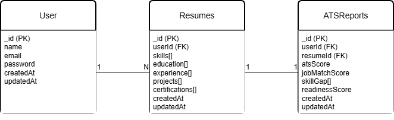

# AI-Powered Job Market Intelligence Platform

## Overview

The AI-Powered Job Market Intelligence Platform is a full-stack web application designed to help job seekers analyze their resumes, evaluate ATS compatibility, identify skill gaps, and receive data-driven career insights.

The platform combines modern web technologies, artificial intelligence, and job market analytics to provide personalized recommendations and improve employability.

---

## Features

### Current Features (Completed)

* Project setup and architecture
* React frontend structure
* Node.js + Express backend
* MongoDB Atlas database integration
* Mongoose configuration
* Database schema design
* ER Diagram documentation
* User Authentication System
* JWT-based Authorization
* Protected API Routes
* Password Hashing with bcrypt
* Resume Upload Module
* PDF Resume Upload Support
* Multer File Handling
* Secure Resume Upload API
* Resume Storage in MongoDB
* User-Resume Association

### Planned Features

* Resume Parsing
* ATS Score Analysis
* Job Match Scoring
* Skill Gap Detection
* Career Readiness Assessment
* Personalized Learning Roadmaps
* Job Market Trend Analytics
* AI Chat Assistant

---

## Technology Stack

### Frontend

* React
* Vite
* React Router DOM
* Axios
* CSS / UI Components

### Backend

* Node.js
* Express.js
* MongoDB Atlas
* Mongoose
* JWT Authentication
* Multer
* dotenv
* CORS

### Database

* MongoDB Atlas

### Authentication

* JWT (JSON Web Tokens)
* bcryptjs

### File Upload

* Multer

---

## Project Structure

```text
AI-Job-Market-Intelligence
│
├── frontend
│   ├── public
│   ├── src
│   └── package.json
│
├── backend
│   ├── src
│   │   ├── config
│   │   │   ├── db.js
│   │   │   └── multer.js
│   │   │
│   │   ├── models
│   │   │   ├── User.js
│   │   │   ├── Resume.js
│   │   │   └── ATSReport.js
│   │   │
│   │   ├── routes
│   │   │   ├── authRoutes.js
│   │   │   └── resumeRoutes.js
│   │   │
│   │   ├── controllers
│   │   │   ├── authController.js
│   │   │   └── resumeController.js
│   │   │
│   │   ├── middleware
│   │   │   └── authMiddleware.js
│   │   │
│   │   └── app.js
│   │
│   ├── uploads
│   ├── .env
│   └── package.json
│
├── docs
│   └── ER_Diagram.png
│
└── README.md
```

---

## Database Design

The application uses MongoDB Atlas as the primary database and Mongoose as the ODM.

### Collections

#### Users

Stores user account information:

* Name
* Email
* Password
* Created At
* Updated At

#### Resumes

Stores uploaded and processed resume information:

* User Reference
* Resume File Path
* Skills
* Education
* Experience
* Projects
* Certifications
* Created At
* Updated At

#### ATSReports

Stores resume analysis results:

* User Reference
* Resume Reference
* ATS Score
* Job Match Score
* Skill Gap Analysis
* Readiness Score
* Created At
* Updated At

---

## Authentication System

The platform implements secure JWT-based authentication.

### Features

* User Registration (Signup)
* User Login
* Password Hashing using bcrypt
* JWT Token Generation
* JWT Verification Middleware
* Protected API Routes

### Authentication Flow

```text
User Signup
      ↓
User Login
      ↓
JWT Token Issued
      ↓
Protected Route Access
```

---

## Resume Upload System

The platform supports secure PDF resume uploads.

### Features

* PDF-only uploads
* JWT-protected upload endpoint
* Multer-based file handling
* Automatic file naming
* Resume metadata storage in MongoDB
* User-to-resume linking

### Upload Flow

```text
User Uploads Resume
          ↓
Multer Processes File
          ↓
File Stored in uploads/
          ↓
Resume Record Created in MongoDB
          ↓
Resume Linked to User
```

---

## API Endpoints

### Authentication

#### Register User

```http
POST /api/auth/signup
```

#### Login User

```http
POST /api/auth/login
```

#### Protected Route

```http
GET /api/protected
```

---

### Resume

#### Upload Resume

```http
POST /api/resume/uploadResume
```

Headers:

```text
Authorization: Bearer <JWT_TOKEN>
```

Body:

```text
form-data

resume → PDF File
```

---

## Entity Relationship Diagram



### Relationships

* One User can have multiple Resumes (1:N)
* One Resume generates one ATS Report (1:1)

---

## Installation

### Clone Repository

```bash
git clone https://github.com/sanskrutimahato/AI-Job-Market-Intelligence.git
cd AI-Job-Market-Intelligence
```

### Backend Setup

```bash
cd backend
npm install
```

Create a `.env` file:

```env
PORT=5000
MONGO_URI=your_mongodb_connection_string
JWT_SECRET=your_secret_key
```

Start backend:

```bash
npm run dev
```

### Frontend Setup

```bash
cd frontend
npm install
npm run dev
```

---

## Security Features

* Password Hashing using bcrypt
* JWT Authentication
* Protected API Routes
* Token Verification Middleware
* PDF-only Resume Upload Validation
* Secure User-Resume Association

---

## Current Progress

| Phase | Status |
|---------|---------|
| Phase 1 – Requirements Analysis | ✅ Complete |
| Phase 2 – Project Setup | ✅ Complete |
| Phase 3 – Database Design | ✅ Complete |
| Phase 4 – Authentication System | ✅ Complete |
| Phase 5 – Resume Upload Module | ✅ Complete |
| Phase 6 – Resume Parsing | 🚧 In Progress |
| Phase 7 – Integration | ⏳ Pending |
| Phase 8 – ATS & Analytics Engine | ⏳ Pending |
| Phase 9 – AI Features | ⏳ Pending |
| Phase 10 – Frontend Dashboard | ⏳ Pending |
| Phase 11 – Testing & Deployment | ⏳ Pending |

---

## Contributors

### Person 1

* Resume Parsing
* ATS Analysis
* Skill Gap Detection
* AI Modules
* Job Market Analytics

### Person 2

* Database Design
* Authentication System
* Resume Upload Module
* Backend Development
* API Development
* Frontend Integration
* Deployment Support

---

## Future Enhancements

* Resume Parsing with AI
* ATS Score Calculation
* Job Match Prediction
* Skill Gap Analysis
* Personalized Career Roadmaps
* Learning Recommendations
* AI Career Mentor
* Job Market Trend Analytics
* Interactive Dashboard

---

## License

This project is developed for academic and educational purposes.